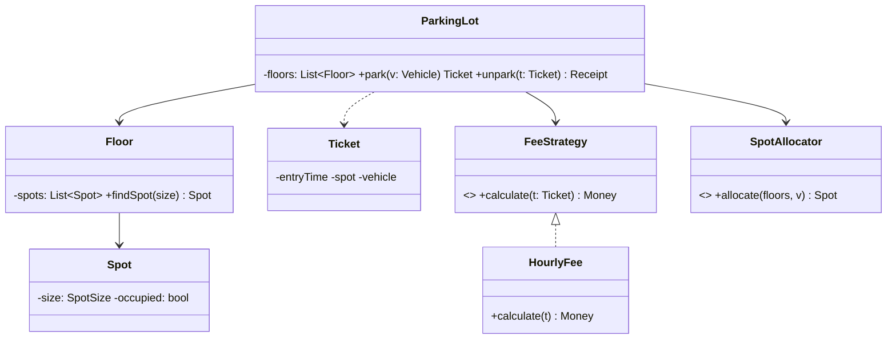

LLD rounds ("design a parking lot / elevator / Splitwise / chess") test whether you can turn fuzzy requirements into clean classes under time pressure. The failure mode is diving into code; the fix is a visible, repeatable process.

## The 5-step method (45-minute pacing)

1. **Clarify requirements (5 min).** Scope aggressively: "Multiple floors? Vehicle types? Payment included, or just allocation?" Write the agreed list down — it's your grading rubric.
2. **Identify entities (5 min).** Nouns → candidate classes: `ParkingLot`, `Floor`, `Spot`, `Vehicle`, `Ticket`, `Gate`. Verbs → responsibilities: park, unpark, calculate fee.
3. **Define relationships & interfaces (10 min).** What owns what (lot *has* floors *has* spots), what varies (fee rules, spot-allocation strategy → interfaces), what's an enum vs a hierarchy (`SpotSize` enum; `Vehicle` hierarchy only if behavior differs).
4. **Walk the core flows (15 min).** Narrate `park(vehicle)` end to end through your classes; write the 2–3 methods with real logic. This is where the design proves itself — or breaks, which is fine *if you fix it out loud*.
5. **Harden (10 min).** Concurrency (two cars, one spot), edge cases (lot full, lost ticket), extension probes ("add EV charging?" — should be a new spot type + strategy, not surgery).

## Parking lot in brief

Decisions worth narrating: fee calculation and spot allocation are **Strategy interfaces** (rules change; OCP); `Spot` occupancy flips under a **lock or atomic CAS** (two gates, one spot); `Ticket` is an immutable record — the fee computes from it, it doesn't mutate.

## What interviewers grade

- Did you **ask before designing**, and keep scope honest?
- Entities with single responsibilities and dependencies on interfaces where change is likely.
- A **working core flow** — not 15 empty class stubs.
- Concurrency acknowledged where it's real (allocation, payments).
- Graceful evolution when they add a requirement — the real test of the design.

The meta-skill: keep talking. A silent perfect design scores worse than a good design with narrated trade-offs, because the narration *is* the signal.
