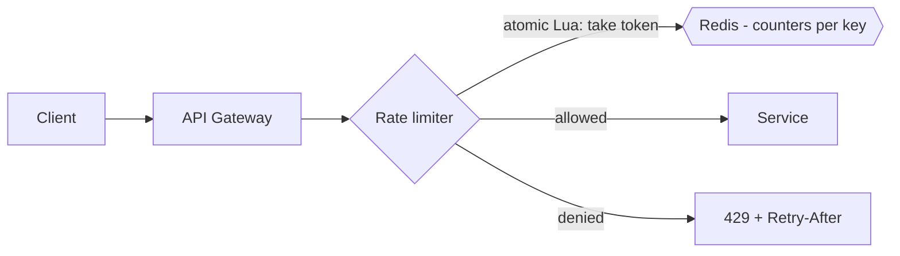

Rate limiting caps how many requests a client may make per time window — protecting you from abuse, runaway retry loops, and one tenant starving the rest. It's also a product surface: quotas per pricing tier.

## Algorithms

- **Token bucket (the default answer).** A bucket holds up to `capacity` tokens, refilled at `rate`/sec; each request spends one. Allows short bursts (up to capacity) while enforcing the average rate — matching how real clients behave. O(1) state per key: `(tokens, lastRefillTs)`.
- **Leaky bucket.** Requests drain at a fixed rate; smooths bursts into a steady stream. Use when downstream genuinely needs constant throughput.
- **Fixed window counter.** `count per (key, minute)`. Trivially cheap, but the boundary problem allows ~2× the limit across a window edge (100 requests at 0:59, 100 more at 1:01).
- **Sliding window log.** Store every request timestamp; exact but O(requests) memory per key.
- **Sliding window counter.** Weighted blend of current + previous window counts — near-exact at O(1) memory. The practical upgrade over fixed windows.

## Distributed enforcement

One API gateway node can count locally; a fleet cannot. Standard design: counters in **Redis**, with the check-and-decrement done atomically in a **Lua script** (read-then-write from N gateways races and over-admits). Latency-sensitive setups split the budget: each node enforces `limit / N` locally and syncs to Redis asynchronously — slightly loose, much faster.

**Fail-open or fail-closed?** If Redis is down: fail-open (allow) for user-facing paths — availability over strictness; fail-closed for expensive/dangerous operations. State the choice explicitly; it's a judgment question in disguise.

## API behavior

Return **429 Too Many Requests** with `Retry-After` and `X-RateLimit-Remaining/Reset` headers — well-behaved clients back off instead of hammering. Key limits by user/API key for authenticated traffic (IP-based punishes NAT'd users and barely slows attackers), with a coarse IP layer in front for unauthenticated abuse.

## Interview framing

Say "token bucket per API key, counters in Redis with atomic Lua, 429 + Retry-After, fail-open on limiter outage" and you've covered algorithm, distribution, contract, and failure policy in one sentence — exactly the checklist the interviewer is holding.
