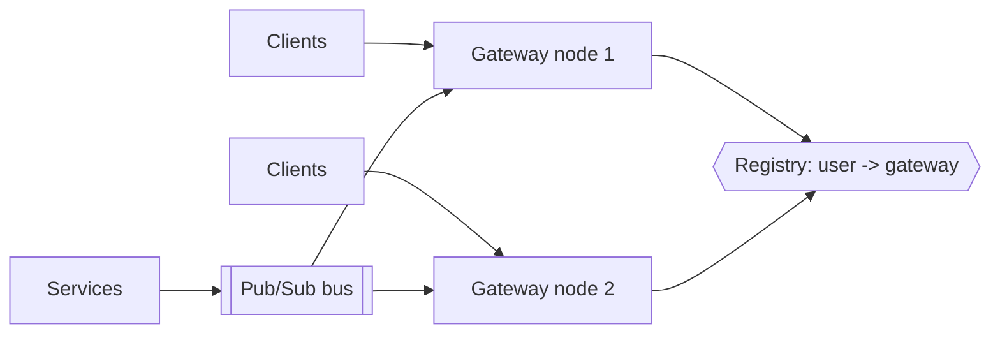

"How does the client find out?" appears in half of all system design interviews — chat, notifications, live scores, collaborative editing, seat maps. There are four answers; know the ladder and climb only as high as the requirement forces you.

## The ladder

### 1. Short polling

Client asks every N seconds. Trivial to build, stateless, works everywhere. Costs: average latency N/2, and mostly-empty responses hammer your servers. Fine for dashboards refreshing every 30s; wrong for chat.

### 2. Long polling

Client asks; server **holds the request open** until data arrives or a timeout (~30s), then the client immediately re-asks. Near-real-time latency with plain HTTP — still the fallback layer under many "WebSocket" products. Costs: a held connection per client, thundering re-connects, and one-directional flow.

### 3. Server-Sent Events (SSE)

One long-lived HTTP response streaming `text/event-stream` messages. Native browser API (`EventSource`) with **automatic reconnection and resume** (`Last-Event-ID`) built in. Server→client only. The right answer for feeds, notifications, tickers, LLM token streams — anything where the client mostly listens.

### 4. WebSockets

A persistent, full-duplex TCP conversation upgraded from HTTP. Lowest latency, bidirectional, message framing included. The right answer for chat, multiplayer, collaborative editing — anything with meaningful **client→server** frequency too. Costs: stateful connections that break load balancing assumptions, heartbeats, reconnect logic, and proxies that hate long-lived connections.

**Rule of thumb**: need server→client only? SSE. Need both directions at low latency? WebSockets. Neither? Poll and keep your life simple.

## Scaling the connection layer

The hard part isn't the protocol — it's holding **millions of open connections** and routing messages to the right ones.

- **Dedicated gateway tier**: connection-holding nodes that do nothing but terminate sockets and forward. A node holds ~100K–1M connections (memory + FD bound); business logic lives behind them, stateless as usual.
- **Routing**: when a service must reach user X, it either looks up X's gateway in a registry (Redis: `user → node`) and targets it, or — simpler and standard — **publishes to a pub/sub channel** that every gateway subscribes to per-user/topic; the gateway holding X's socket delivers.
- **Load balancing**: L4 pass-through or L7 with WebSocket upgrade support; sticky by connection (not per-request). Draining a gateway for deploys = telling clients to reconnect gradually.
- **Heartbeats**: ping/pong every ~30s to detect dead connections and keep NATs/proxies from silently killing idle sockets.

## Reliability: the connection is not the delivery

A socket delivers only to clients online *right now*. Real systems pair the push channel with durable state:

- Persist messages first (chat DB, notification log), then push — the socket is an optimization, not the source of truth.
- On reconnect, the client syncs missed messages by sequence number/timestamp (SSE gives you `Last-Event-ID` for free; on WebSockets you build it).
- Mobile apps in the background can't hold sockets — hand off to platform push (APNs/FCM).

## Interview Q&A

**Q: Chat app — which transport and why?**
A: WebSockets (bidirectional, low latency) with long-polling fallback. Messages persist to the store before fan-out; sequence numbers per conversation make reconnect sync trivial.

**Q: 5M users watching live sports scores?**
A: Server→client only, identical payload for everyone → SSE (or even coarse polling at the CDN edge — a 1-second-TTL cached JSON endpoint scales absurdly well and is the sleeper answer).

**Q: Why do WebSockets complicate deployments?**
A: Connections are long-lived state on specific nodes: rolling deploys must drain (force gradual reconnects), autoscaling down kills sessions, and LBs need upgrade/sticky support. Stateless HTTP has none of these.

**Q: How does a backend service message one specific connected user?**
A: Pub/sub keyed by user ID — every gateway subscribes for its connected users; the publisher doesn't need to know where the socket lives. Registry lookup + direct RPC is the lower-latency alternative at more bookkeeping cost.
