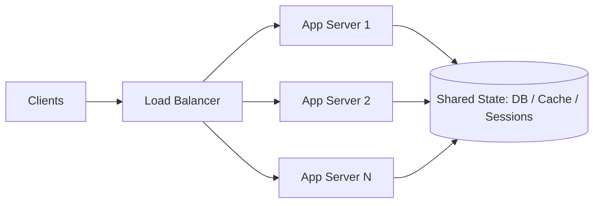

**Vertical scaling** (scale up) buys a bigger machine: more CPU, RAM, faster disks. Zero code changes, no distributed-systems complexity — and it's the right first move more often than interview folklore admits. Limits: hardware ceilings, cost grows super-linearly at the top end, and one machine is still one failure domain.

**Horizontal scaling** (scale out) adds machines behind a load balancer. Capacity grows roughly linearly with commodity hardware, and failures become partial instead of total. The price: your architecture must handle distribution.

## What horizontal scaling actually requires

- **Stateless services.** Any request must be servable by any server, so session state moves out of process memory into Redis/DB or signed tokens (JWT). This is the single most important enabler — stateless boxes can be added, removed, and replaced freely (and autoscaled).
- **Externalized state.** The state doesn't disappear; it concentrates in the data tier. Which means…
- **The database becomes the bottleneck.** App tiers scale trivially; data tiers don't. The standard escalation: read replicas → caching → sharding (see [database sharding]) — each step buying headroom at the cost of consistency or complexity.

## Interview framing

When asked "how does this scale?", walk the tiers in order: stateless app tier behind an LB (easy), then attack the data tier explicitly. Numbers help: a tuned Postgres box handles thousands of writes/sec — if your estimate says 50K writes/sec, say "a single primary can't take this; we shard by X."

Also name the ceiling nobody mentions: **coordination**. Anything requiring all nodes to agree (distributed transactions, global locks, leader election) scales worst of all — the best designs minimize what must be agreed upon, not just add servers.
